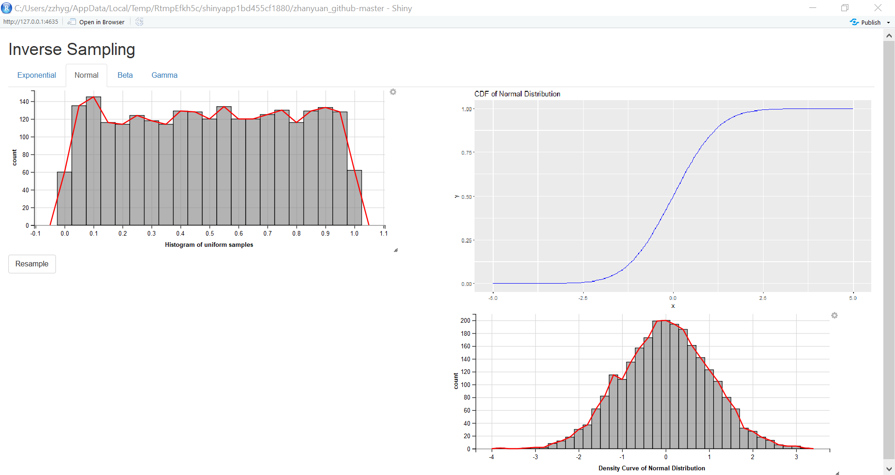

# Inverse Sampling and Its Visualization on R
### 1. Introduction
  One awesome thing that people can do with computer is to generate random samples from arbitrary distribution. This technique called [**Inverse Sampling**](https://en.wikipedia.org/wiki/Inverse_transform_sampling) (see Wikipedia). This post will focus on how the computer generates some common continous distributions by simply sampling numbers randomly and uniformly from interval $[0, 1]$. **This has important application because it allows people to simulate many distributions from one of the simplest distribution -- standard uniform distribution.** Finally, I will try to find a way to visualize this sampling process via `Shiny` app.

### 2. Theoratical Basis and Packages Preparation
  The following theorem supports the idea of inverse sampling: [Source](https://www.probabilitycourse.com/chapter13/Chapter_13.pdf).
  
> Let $U \sim Uniform(0, 1)$, and F be a CDF which is strictly increasing. Also, consider a random variable X defined as $$X = F^{-1}(U)$$ Then, $$X \sim F$$ In other words, the CDF of X is F

#### The following picture illustrates the transformation described in the theorem:
  
  
  To facilitate the illustration, we need to import some packages.  
  __Note:__ we did not mention the package `GoFKernel`. It is a package, by Jose Pavia, for testing goodness-of-fit based on a kernel smoothing of the data. You can run the following code to install this package. We need its `inverse()` function to find the inverse CDF handily.  
  For more information, see [source](https://www.rdocumentation.org/packages/GoFKernel/versions/2.1-0)
```{r eval=FALSE}
install.packages("GoFKernel")
```

```{r warning=FALSE, message=FALSE}
library(ggplot2)
library(GoFKernel)
library(dplyr)
```


### 3. Simple Demonstrations
  In this section, I am going to use three examples to demonstrate how this simulation sampling works. First, I am going to get a big enough amount of sample numbers uniformly from 0 to 1. Then, I will generate random samples from $Exponential(\lambda = 3)$, $Normal (\mu = 0, \sigma^{2} = 1)$, and $Beta(r = 2, s = 3)$ respectively from the uniform samples. By plotting their histograms, the upper edge of  the histograms can illustrate the resulting density curve nicely, as you are going to see.

#### 1). Uniform Sampling
I first sample 20000 numbers uniformly $[0, 1]$  (I guess this is big enough). To get the same sampling result, you can code `set.seed(42)` before sampling.
To facilitate our plotting, I generate a data frame saving the uniform samples, and later it will also store all the transformation samples.
```{r}
set.seed(42)
U <- runif(20000, min = 0, max = 1)
dat <- as.data.frame(U)
```

**Try to plot the histogram of the uniform samples:**
```{r}
ggdat <- ggplot(data = dat)
ggdat +
  geom_histogram(aes(x = U), bins = 69) +
  geom_freqpoly(aes(x = U), bins = 69, color = "red", size = 1.2, alpha = 0.7) +
  ggtitle("Simulated density curve of U (U ~ Uniform (0, 1))")
```

Regardless of the line at the two endes, the red line shows that each number has roughly same amount.

#### 2). Simulated Exponential Distribution
**Now let's find out the inverse CDF of an $Exponential(\lambda = 3)$ by the `inverse()` from the package `GoFKernel`. After doing this, we can add a column of transformed samples called _X1_ in the data frame.**
```{r}
expon <- function(x) pexp(x, rate = 3)
invexpon <- inverse(expon, lower = 0, upper = Inf)
X1 <- c()
for (i in 1:length(U)) {
  X1[i] <- invexpon(U[i])
}
dat <- mutate(dat, X1 = X1)
```

**Now, we can plot the histogram of the samples transformed by the inverse exponential CDF**
```{r}
ggdat +
  geom_histogram(aes(x = X1), bins = 69) + 
  geom_freqpoly(aes(x = X1), bins = 70, color = "red", size = 1.2, alpha = 0.7) +
  ggtitle("Simulated density curve of X1 (X1 ~ Exp(3))")
```

With the help of graphic calculator, you can find that it looks pretty closed to the graph of function $f_{X}(x) = 3e^{-3x}$, which is the density function of $X \sim Exponential(\lambda = 3)$.

#### 3). Simulated Normal Distribution
**Next, add another column called _X2_ containing transformed samples by inverse standard normal CDF:**
```{r}
stnorm <- function(x) pnorm(x, mean = 0, sd = 1)
invnorm <- inverse(stnorm)
X2 <- c()
for (i in 1:length(U)) {
  X2[i] <- invnorm(U[i])
}
dat <- mutate(dat, X2 = X2)
```

**Similarly as above, do the plotting:**
```{r}
ggdat +
  geom_histogram(aes(x = X2), bins = 69) +
  geom_freqpoly(aes(x = X2), bins = 70, color = "red", size = 1.2, alpha = 0.7) +
  ggtitle("Simulated density curve of X2 (X2 ~ Norm(0, 1))")
```

**Since we are simulating the _famous_ standard normal density curve, we can easily compare it to the _correct_ one:**


#### 4). Simulated Beta Distribution
**Now, let's find out the inverse CDF of the $Beta(r = 2, s = 3)$, and then add another column called _X3_ containing the transformed samples:**
```{r}
beta23 <- function(x) pbeta(x, shape1 = 2, shape2 = 3)
invbeta23 <- inverse(beta23, lower = 0, upper = 1)
X3 <- c()
for (i in 1:length(U)) {
  X3[i] <- invbeta23(U[i])
}
dat <- mutate(dat, X3 = X3)
```

**Let's see the plotting:**
```{r}
ggdat +
  geom_histogram(aes(x = X3), bins = 100) + 
  geom_vline(xintercept = 2/5, color = "red", size = 1.5, alpha = 0.7) +
  geom_freqpoly(aes(x = X3), bins = 100, color = "red", size = 1.2, alpha = 0.7) +
  ggtitle("Simulated density curve of X3 (X3 ~ Beta (2, 3))")
```

We know that the expectation value of $X \sim Beta(r = 2, s = 3)$ is $E(X) = \frac{r}{r+s} = \frac{2}{5}$, which is shown by the vertical red line. The peak of the simulated curve is closed to the actual expectation, which tells us that the transformed samples give a decent simulation.


### 4. Turn into a `Shiny` App
Now we know how to utilize the `inverse()` function in `GoFKernel` to find inverse function of a CDF, and the demonstrations above shows graphically how to conduct inverse sampling via those inverse functions.  
**Since we have already had the general ideas in mind, why not turn all these into a `Shiny` app?** 

#### In this section, I will show you how to build up an app that allows people to:
1). sample certain amount of numbers uniformly from $[0, 1]$;  
2). transform the uniform samples into samples from other distributions;  
3). Show the cdf curve of the given distribution;  
4). visualize the simulated density curves of both the uniform samples and the transformed samples.  
_Note:_ Since this app intends to visualize _inverse sampling,_ we don't have to consider the parameters of the distributions.  

For guidance purpose, I will code the app step-by-step with full explanations. To reproduce this app, you can either copy-paste my code, **OR** you can run the code right after the preview picture of the app on your **Rstudio** to run the app.  

### **Here is how the app looks like:** (Note that the larger the slope of CDF, the more likely that the corresponding samples to be turned into, since the slope of CDF represents the probability density, by definition.)


**PLEASE! Run this code on you Rstudio to try the app!!!**
```{r eval=FALSE}
shiny::runGitHub('zhanyuan_github', 'ucbzhanyuan')
```

### **Ok! Let see how I make this app:**  

Here is the entire Shiny app code for this app. Take a glance to find the functions that you are not familiar with and then scroll down to see their explanations.  
```{r eval=FALSE}

# required packages
library(shiny)
library(ggplot2)
library(ggvis)
library(dplyr)
library(GoFKernel)

# import cdf
source("../functions.R")

# Define UI for application that draws a histogram
ui <- fluidPage(
   
   # Application title
   titlePanel("Inverse Sampling"),
   
   tabsetPanel(
     tabPanel(title = "Exponential",
              fluidRow(
                column(6, ggvisOutput("unif"),
                       actionButton("resample", "Resample")),
                column(6, plotOutput("expdens"))
              ),
              fluidRow(
                column(6),
                column(6, ggvisOutput("exp"))
              )
              ),
     tabPanel(title = "Normal",
              fluidRow(
                column(6, ggvisOutput("unif2"),
                       actionButton("resample2", "Resample")),
                column(6, plotOutput("nordens"))
              ),
              fluidRow(
                column(6),
                column(6, ggvisOutput("nor"))
              )
              ),
     tabPanel(title = "Beta",
              fluidRow(
                column(6, ggvisOutput("unif3"),
                       actionButton("resample3", "Resample")),
                column(6, plotOutput("betdens"))
              ),
              fluidRow(
                column(6),
                column(6, ggvisOutput("bet"))
              )
              ),
     tabPanel(title = "Gamma",
              fluidRow(
                column(6, ggvisOutput("unif4"),
                       actionButton("resample4", "Resample")),
                column(6, plotOutput("gamdens"))
              ),
              fluidRow(
                column(6),
                column(6, ggvisOutput("gam"))
              )
              )
   )
)

# Define server logic required to draw a histogram
server <- function(input, output) {
  # Uniform sampling
  rv <- reactiveValues(
    U1 = runif(2500),
    U2 = runif(2500),
    U3 = runif(2500),
    U4 = runif(2500))
  # resample button
  observeEvent(input$resample, { rv$U1 <- runif(2500) })
  observeEvent(input$resample2, { rv$U2 <- runif(2500) })
  observeEvent(input$resample3, { rv$U3 <- runif(2500) })
  observeEvent(input$resample4, { rv$U4 <- runif(2500) })
  
  vis_unif <- reactive({
    dat <- data.frame(u = rv$U1)
    dat %>% ggvis(~u) %>%
      layer_histograms(fill := "grey", fillOpacity := 0.6, fillOpacity.hover := 0.8) %>%
      layer_freqpolys(stroke := "red", strokeWidth := 2) %>%
      add_axis("x", title = "Histogram of uniform samples") %>%
      set_options(width = 700, height = 300)
  })
  vis_unif %>% bind_shiny("unif")
  
  vis_unif <- reactive({
    dat <- data.frame(u = rv$U2)
    dat %>% ggvis(~u) %>%
      layer_histograms(fill := "grey", fillOpacity := 0.6, fillOpacity.hover := 0.8) %>%
      layer_freqpolys(stroke := "red", strokeWidth := 2) %>%
      add_axis("x", title = "Histogram of uniform samples") %>%
      set_options(width = 700, height = 300)
  })
  vis_unif %>% bind_shiny("unif2")
  
  vis_unif <- reactive({
    dat <- data.frame(u = rv$U3)
    dat %>% ggvis(~u) %>%
      layer_histograms(fill := "grey", fillOpacity := 0.6, fillOpacity.hover := 0.8) %>%
      layer_freqpolys(stroke := "red", strokeWidth := 2) %>%
      add_axis("x", title = "Histogram of uniform samples") %>%
      set_options(width = 700, height = 300)
  })
  vis_unif %>% bind_shiny("unif3")
  
  vis_unif <- reactive({
    dat <- data.frame(u = rv$U4)
    dat %>% ggvis(~u) %>%
      layer_histograms(fill := "grey", fillOpacity := 0.6, fillOpacity.hover := 0.8) %>%
      layer_freqpolys(stroke := "red", strokeWidth := 2) %>%
      add_axis("x", title = "Histogram of uniform samples") %>%
      set_options(width = 700, height = 300)
  })
  vis_unif %>% bind_shiny("unif4")
  
  # exponential cdf
  output$expdens <- renderPlot({
    ggplot(data = data.frame(x = c(0, 10)), aes(x = x)) +
      stat_function(fun = function(x) 1 - exp(-3 * x), color = "blue") +
      ggtitle("CDF of Exponential Distribution")
  })
  
  # normal cdf
  output$nordens <- renderPlot({
    ggplot(data = data.frame(x = c(-5, 5)), aes(x = x)) +
      stat_function(fun = pnorm, args = list(mean = 0, sd = 1), color = "blue") +
      ggtitle("CDF of Normal Distribution")
    
  })
  
  # beta cdf
  output$betdens <- renderPlot({
    ggplot(data = data.frame(x = c(0, 1)), aes(x = x)) +
      stat_function(fun = pbeta, args = list(shape1 = 2, shape2 = 3), color = "blue") +
      ggtitle("CDF of Beta Distribution")
  })
  
  # gamma cdf
  output$gamdens <- renderPlot({
    ggplot(data = data.frame(x = c(0, 0.6)), aes(x = x)) +
      stat_function(fun = pgamma, args = list(shape = 3, scale = 0.05), color = "blue") +
      ggtitle("CDF of Gamma Distribution")
  })
  
  
  # exponential
  vis_exp <- reactive({
    dat <- data.frame(u = rv$U1)
    X1 <- c()
    for (i in 1:length(rv$U1)) {
      X1[i] <- invexpon(rv$U1[i])
    }
    dat <- mutate(dat, X1 = X1)
    dat %>% ggvis(~X1) %>%
      layer_histograms(fill := "grey", fillOpacity := 0.6, fillOpacity.hover := 0.8) %>%
      layer_freqpolys(stroke := "red", strokeWidth := 2) %>%
      add_axis("x", title = "Density Curve of Exponential Distribution") %>%
      set_options(width = 700, height = 300)
  })
  vis_exp %>% bind_shiny("exp")
  
  # normal
  vis_nor <- reactive({
    dat2 <- data.frame(u = rv$U2)
    X2 <- c()
    for (i in 1:length(rv$U2)) {
      X2[i] <- invnorm(rv$U2[i])
    }
    dat2 <- mutate(dat2, X2 = X2)
    dat2 %>% ggvis(~X2) %>%
      layer_histograms(fill := "grey", fillOpacity := 0.6, fillOpacity.hover := 0.8) %>%
      layer_freqpolys(stroke := "red", strokeWidth := 2) %>%
      add_axis("x", title = "Density Curve of Normal Distribution") %>%
      set_options(width = 700, height = 300)
  })
  vis_nor %>% bind_shiny("nor")
  
  # beta
  vis_bet <- reactive({
    dat3 <- data.frame(u = rv$U3)
    X3 <- c()
    for (i in 1:length(rv$U3)) {
      X3[i] <- invbeta23(rv$U3[i])
    }
    dat3 <- mutate(dat3, X3 = X3)
    dat3 %>% ggvis(~X3) %>%
      layer_histograms(fill := "grey", fillOpacity := 0.6, fillOpacity.hover := 0.8) %>%
      layer_freqpolys(stroke := "red", strokeWidth := 2) %>%
      add_axis("x", title = "Density Curve of Beta Distribution") %>%
      set_options(width = 700, height = 300)
  })
  vis_bet %>% bind_shiny("bet")
  
  # Gamma
  vis_gam <- reactive({
    dat4 <- data.frame(u = rv$U4)
    X4 <- c()
    for (i in 1:length(rv$U4)) {
      X4[i] <- invgamma6(rv$U4[i])
    }
    dat3 <- mutate(dat4, X4 = X4)
    dat3 %>% ggvis(~X4) %>%
      layer_histograms(fill := "grey", fillOpacity := 0.6, fillOpacity.hover := 0.8) %>%
      layer_freqpolys(stroke := "red", strokeWidth := 2) %>%
      add_axis("x", title = "Density Curve of Gamma Distribution") %>%
      set_options(width = 700, height = 300)
  })
  vis_gam %>% bind_shiny("gam")
  
}

# Run the application 
shinyApp(ui = ui, server = server)


```

#### **Here are the step-by-step explanations of how to build this app:**  

1). **Preparations:** I want this app shows the simulated sampling from the following distributions:  
  a. Exponential
  b. Normal
  c. Beta
  d. Gamma
Therefore, we can **create a R script file** to save the cdf's and inverse cdf's we need. Here is the code for the functions.
```{r eval=FALSE}
# inverse exp cdf
expon <- function(x) pexp(x, rate = 3)
invexpon <- inverse(expon, lower = 0, upper = Inf)

# inverse normal cdf
stnorm <- function(x) pnorm(x, mean = 0, sd = 1)
invnorm <- inverse(stnorm)

# inverse beta cdf
beta23 <- function(x) pbeta(x, shape1 = 2, shape2 = 3)
invbeta23 <- inverse(beta23, lower = 0, upper = 1)

# inverse gamma cdf
gamma6 <- function(x) pgamma(x, rate = 0.5, shape = 6)
invgamma6 <- inverse(gamma6, lower = 0, upper = Inf)

unif <- function(x) x = x
```


2). **Ui section:** To  build the layout in the Shiny app, we need to utilize `fluidRow()` and `column()` functions. In addition, we need an **action button** for the resample purpose. Since the layouts of the four tabs are almost identical, in the *ui* section, we basically copy-paste this code for three more times. For more information about building layouts, see [source](https://vimeo.com/rstudioinc/review/131218530/212d8a5a7a/#t=1h59m4s)  
**In the example of the first tab _ui_ (for exponential distribution):**
```{r eval=FALSE}
     tabPanel(title = "Exponential",
              fluidRow(
                column(6, ggvisOutput("unif"),
                       actionButton("resample", "Resample")),
                column(6, plotOutput("expdens"))
              ),
              fluidRow(
                column(6),
                column(6, ggvisOutput("exp"))
              )
              )
```

3). **Server section:** Server is the place that makes thing difficult.  
  a). First I need to activate the **Resample** button. In order to ask the app to do the resampling once we click, we need functions called `reactiveValues()`and `observeEvent()`. For more information about the practical use of these functions, see [source](https://vimeo.com/rstudioinc/review/131218530/212d8a5a7a/#t=1h59m4s).
```{r eval=FALSE}
  rv <- reactiveValues(
    U1 = runif(2500),
    U2 = runif(2500),
    U3 = runif(2500),
    U4 = runif(2500))
  # resample button
  observeEvent(input$resample, { rv$U1 <- runif(2500) })
  observeEvent(input$resample2, { rv$U2 <- runif(2500) })
  observeEvent(input$resample3, { rv$U3 <- runif(2500) })
  observeEvent(input$resample4, { rv$U4 <- runif(2500) })

```
  b). Next, we should plot the histogram of the uniform sampling. Here, we use `ggvis` to do the plotting. As they need to show up in all four tabs, we need to write the following code four times with different variables (U1, U2...):
```{r eval=FALSE}
  vis_unif <- reactive({
    dat <- data.frame(u = rv$U1)
    dat %>% ggvis(~u) %>%
      layer_histograms(fill := "grey", fillOpacity := 0.6, fillOpacity.hover := 0.8) %>%
      layer_freqpolys(stroke := "red", strokeWidth := 2) %>%
      add_axis("x", title = "Histogram of uniform samples") %>%
      set_options(width = 700, height = 300)
  })
  vis_unif %>% bind_shiny("unif")
```

  c). Analogously, we can plot the histogram for all the transformed samples. Take the **Normal Distribution** as an example:
```{r eval=FALSE}
  # normal
  vis_nor <- reactive({
    dat2 <- data.frame(u = rv$U2)
    X2 <- c()
    for (i in 1:length(rv$U2)) {
      X2[i] <- invnorm(rv$U2[i])
    }
    dat2 <- mutate(dat2, X2 = X2)
    dat2 %>% ggvis(~X2) %>%
      layer_histograms(fill := "grey", fillOpacity := 0.6, fillOpacity.hover := 0.8) %>%
      layer_freqpolys(stroke := "red", strokeWidth := 2) %>%
      add_axis("x", title = "Density Curve of Normal Distribution") %>%
      set_options(width = 700, height = 300)
  })
  vis_nor %>% bind_shiny("nor")
```

  d). Finally, we want to plot the cdf curve of distribution as a reference. I found that `ggplot2` can easily do so with the assistance of the _cdf_ functions in the built-in package `stats`, as following. To know about _Probability Plots, _ see [source](https://www.statmethods.net/advgraphs/probability.html)
```{r eval=FALSE}
  # normal cdf
  output$nordens <- renderPlot({
    ggplot(data = data.frame(x = c(-5, 5)), aes(x = x)) +
      stat_function(fun = pnorm, args = list(mean = 0, sd = 1), color = "blue") +
      ggtitle("CDF of Normal Distribution")
  })
```

#### That's all about it!!! For your convenience, here is the code for running the app:
```{r eval=FALSE}
shiny::runGitHub('zhanyuan_github', 'ucbzhanyuan')
```

### 5. Take Home Message
1). This post visualizes the technique of inverse sampling through `Shiny` app.  
2). In `Shiny` app, we can use `fluidRow()` and `cloumn()` functions to constimize the layouts of the apps.  
3). Regarding interactive plot, `ggvis` is better than `ggplot2`.  
4). Designing an app is fun!  

### 6. Conclusion
**Thanks for reading this post!**  

  One thing that this post taught me was that building a _shiny_ app was definitely not as simple as I thought when I hadn't stated. During the coding process, I designed the layout of the app, I learned how to fully control the layout through `fluidRow()` and `column()`, I realized that the **Resample** button was not as easy as I thought... I made a lot of mistakes and came across many difficulties, and yet I learned from errors and overcame the difficulties.  
  In this post, I try to utilize some packages I've learned about R and combine them with the _inverse sampling_. As you can see, this app is based on `shiny`,  `ggvis`, `ggplot`, `dplyr`,and `GoFKernel`. Building a app without guidance is hard, for the workloads of debugging and designing are way more heavier. However, this _is_ an effective way to check whether I understand R well enough.

### 7. Suggestions? Let me know!
Are there any way to improve this app? I'll say "definitely YES!" For instance, I may be able to use `for` loop to simplify my code, or I may be able to find a way to avoid creating so many variables, or maybe the app can allow users to download the data, or I might be able to find some ways to animate the sampling process... Anyway, if you have any suggestions for me, feel free to let me know!  
Here is my email: zhang_zhanyuan AT berkeley DOT edu

### 8. References:
  1). https://image.slidesharecdn.com/203erikerlandson-170615194512/95/smart-scalable-feature-reduction-with-random-forests-with-erik-erlandson-20-638.jpg?cb=1497555953  
  2). https://saylordotorg.github.io/text_introductory-statistics/section_09/e7a042db29b39bb94416c06789301faa.jpg  
  3). https://www.probabilitycourse.com/chapter13/Chapter_13.pdf  
  4). https://www.rdocumentation.org/packages/GoFKernel/versions/2.1-0  
  5). https://vimeo.com/rstudioinc/review/131218530/212d8a5a7a/#t=1h59m4s  
  6). https://www.statmethods.net/advgraphs/probability.html  
  7). https://shiny.rstudio.com/gallery/widgets.html  
  8). https://en.wikipedia.org/wiki/Inverse_transform_sampling

